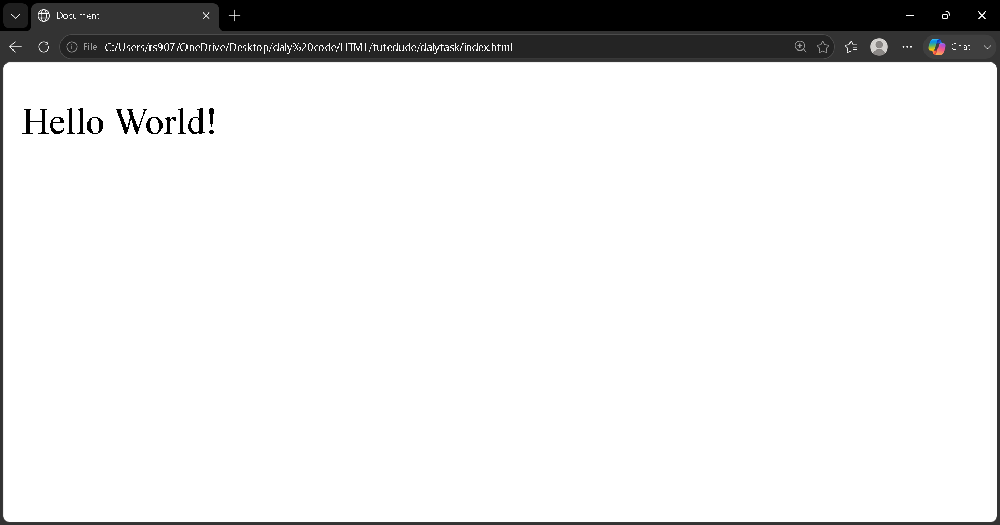

# Task 01 – Hello World HTML 🌐

## 📌 Task Overview

This is my first task from the **Tutedude Web Development MERN Stack course**.

In this task, I created a simple **Hello World webpage using HTML**.

## 🛠️ Technology Used

* HTML5

## 📚 Concepts Practiced

* Basic HTML document structure
* HTML heading
* Displaying text on a webpage

## 📂 Project Files

```text
Task-01-Hello-World/
├── index.html
├── README.md
└── screenshot.png
```

## 📸 Output



## 🎯 Learning Outcome

This task helped me understand the basic structure of an HTML document and how to display content in a web browser.

## ✅ Status

**Completed** 🚀
