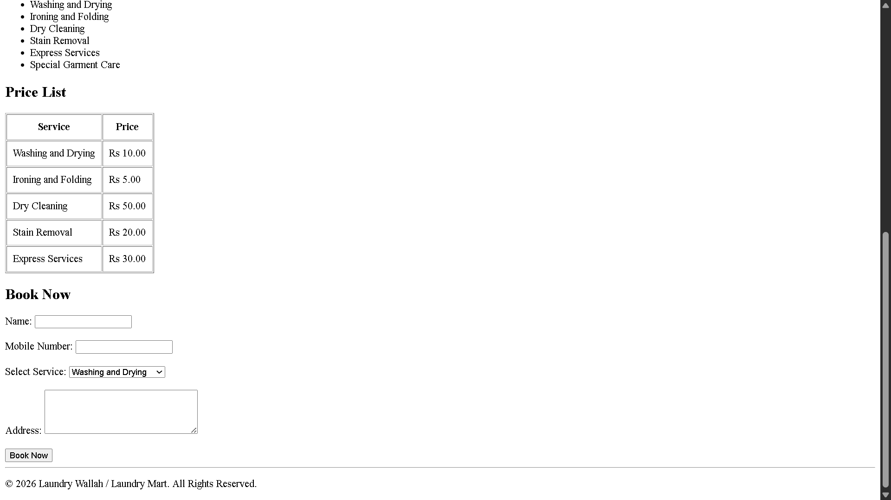

# Task 02 – Laundry Wallah / Laundry Mart 🌐

## 📌 Task Overview

This task is a complete HTML webpage for **Laundry Wallah / Laundry Mart**.

The webpage provides information about the laundry service, available services, pricing, and a booking form.

## 🛠️ Technology Used

* HTML5

## 📚 Concepts Practiced

* HTML document structure
* Headings and paragraphs
* HTML sections
* Images
* Unordered lists
* Tables
* Forms
* Input fields
* Select dropdown
* Textarea
* HTML comments
* Footer

## 📂 Project Files

```text
Task-02-HTML/
├── index.html
├── README.md
└── screenshot.png
```

## ✨ Features

* Welcome header
* About Us section
* Laundry image
* List of laundry services
* Price list table
* Booking form
* Footer section

## 📸 Output




## 🎯 Learning Outcome

This task helped me practice creating a complete webpage using HTML and understand how different HTML elements such as images, lists, tables, forms, and sections can be combined to create a structured webpage.

## ✅ Status

**Completed** 🚀
