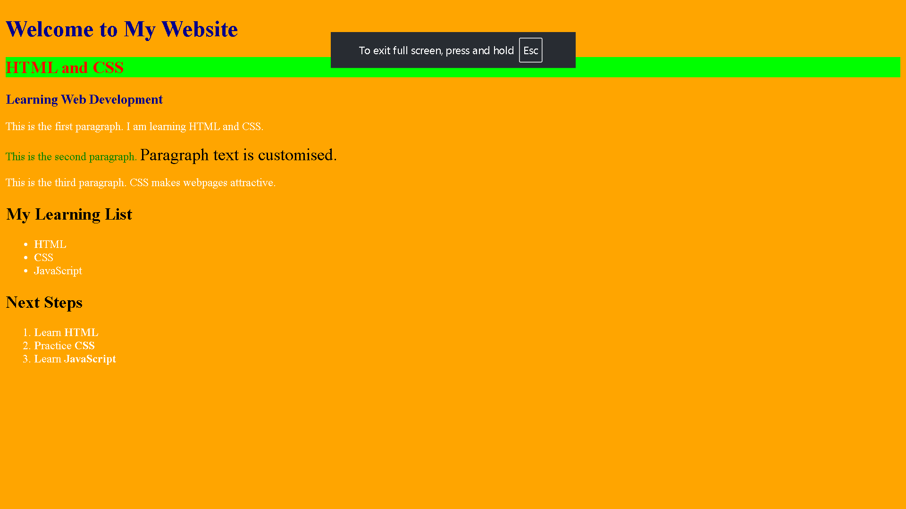

# Task 03 – CSS 🎨

## 📌 Task Overview

This task is part of the **Tutedude Web Development MERN Stack course**.

In this task, I practiced applying CSS styling to an HTML webpage using different CSS selectors and properties.

## 🛠️ Technologies Used

* HTML5
* CSS3

## 📚 Concepts Practiced

* Connecting CSS with HTML
* Element selectors
* Class selectors
* ID selectors
* Descendant selectors
* Background colors
* Text colors
* Font size
* Pseudo-elements
* Styling lists

## 📂 Project Files

```text
Task-03-CSS/
├── index.html
├── style.css
├── README.md
└── screenshot.png
```

## ✨ Features

* Styled headings using a class selector
* Applied different styling using an ID selector
* Styled paragraphs
* Customized text inside a `<span>`
* Styled unordered and ordered lists
* Used the `::first-letter` pseudo-element

## 📸 Output



## 🎯 Learning Outcome

This task helped me understand how CSS selectors and properties can be used to style HTML elements and customize different parts of a webpage.

## 🔗 Source Code

* [HTML Code](./index.html)
* [CSS Code](./style.css)

## ✅ Status

**Completed** 🚀
